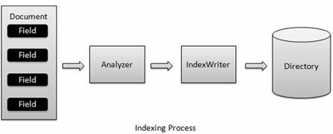
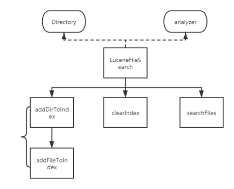
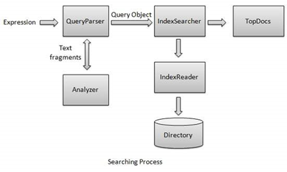
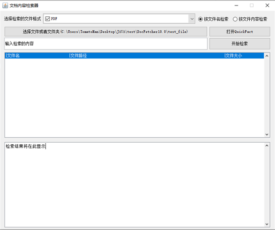
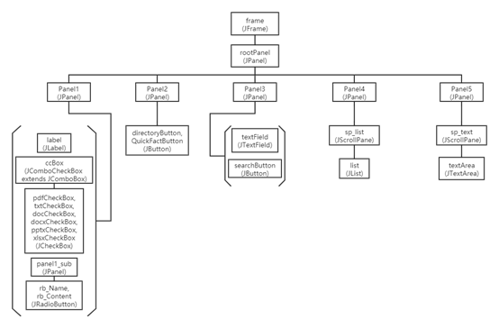

# DocFetcher

### Video Clip

https://youtu.be/_zOHThxIPog

## About This Project

The "Document Retriever" is currently a search engine that most people use in their daily lives, such as Google and Baidu, which can support the use of crawled web page content to obtain results in just a few hundred milliseconds. However, we have not experienced this before the advent of search engines. At that time, we even had to traverse the options of portal websites one by one to enter the web pages we wanted to enter. This may be unbearable for us today. However, unfortunately, most people still use this inefficient search method under the Windows system, and the reason is simple - the search engine of the Windows file resource manager is too inefficient. Therefore, we applied the "reverse search" method of Internet search engines to PC local searches. This search rate not only greatly improves efficiency, but also can search for the full text content except for the title. This search engine has extremely important significance for literature management and help document retrieval.

## Research Purpose

The document retriever is designed to improve the search efficiency and accuracy of full-text search. Full-text search mainly refers to the research on the representation, storage, organization, and access of the entire document information, that is, the search method for retrieving relevant information materials from the information database based on user query requirements. The reason why the Windows built-in document manager is inefficient is not only because of the insufficient PC computing power, but more importantly, it still uses outdated traversal search algorithms. Currently, the reverse search commonly used in the kernel of network search engines is a mapping from keywords to indexes, which avoids the time cost of traversing the entire document. Correspondingly, it needs to establish an index for all documents to achieve the function of "one-time database building, multiple searches". In addition to improving search efficiency, the index also supports keyword scoring, and sorting by score can help people find documents with the highest relevance to keywords.

The theory of reverse search is not complicated, but there are still several practical problems at present. For example, what is the basis for segmentation, whether it supports keyword Boolean search, how to reduce the number of index building, and how to filter unwanted files. These are only problems in the English environment. In the Chinese environment, segmentation will become more complicated, and reading document content also requires more processing. How to solve these problems and establish a practical Chinese search engine is our main goal.

## 关于此项目

“文件获取器”目前大家日常接触到的搜索引擎，例如谷歌，百度等，可以支持对爬取到的互联网页内容，使用仅仅不到数百毫秒的时间得到结果。然而我们获取没有体验过，在搜索引擎出现之前的时代，在那时，我们甚至需要遍历门户网站的一个个选项来进入我们想进入的网页。这对现如今的我们或许难以忍受。然而事实上，很可惜，大部分人在windows系统下仍然使用这种低效率的搜索方式，原因无他，windows文件资源管理器的搜索引擎实在是太低效了。于是，我们将互联网搜索引擎的“倒序搜索”方式应用在了pc本地搜索上。这种搜索测率不仅大大的提高了效率，除了标题以外，还可以搜索全文内容。这种搜索引擎对于文献管理、帮助文档检索有着极其重要的意义。

## 研究目的

文档获取器，是为了提高全文搜索的搜索效率和准确度而产生的。全文检索主要指研究对整个文档信息的表示、存储、组织和访问，即根据用户的查询要求，从信息数据库中检索出相关信息资料的搜索方式。windows自带的文档管理器之所以效率低下，不仅仅是因为PC算力不足，更多的，是由于其仍然在使用落后的遍历查找算法。目前，网络搜索引擎内核普遍使用的倒序搜索，是一个从关键词到索引的映射，这种映射避免了遍历整个文档所需的时间成本，相应的，它需要对所有文档建立索引，实现“一次建库，多次搜索”的功能。除了搜索效率的提高，索引还支持关键词评分，由分数排序可以帮助人们找到和关键词相关性最大的文档。

倒序搜索的理论并不复杂，但当下仍然存在几个现实性的问题。例如，以什么为依据分词，是否支持关键词布尔搜索，如何减少建立索引的次数，如何过滤不需要的文件。这仅仅是在英文环境下的问题，在中文环境下，分词将会变得更加复杂，而且读取文档内容也需要经过更多的加工。如何解决这些问题，建立一个实用的中文搜索引擎，这是我们设计的主要目的

## 关于Lucene

lucene库中主要包含两个部分，第一部分是建立索引，而第二部分是进行搜索

第一部分关键的类有

Document-analyzer-indexWriter-Directroy

关系如下：

图表1建立目录过程

每个类的功能

| Document    | 包含文件中的关键词(field) |
| ----------- | ------------------------- |
| Anaylzer    | 分词器                    |
| IndexWriter | 类比FileWriter            |
| Directory   | 索引                      |

第二部分关键的类有：

analyzer-indexReader-indexSearcher-scoreDoc-TopDocs

搜索过程

| IndexReader   | 读取目录，类比FileReader |
| ------------- | ------------------------ |
| IndexSearcher | 在索引中搜索             |
| TopDocs       | 符合hits的最高x个文件    |

图表3
Lucenefilesearch类包含关系图

其中，analyzer是中文语境下最困难的部分，因为analyzer进行分词，原本可以借助空格分隔符，单在中文语境下，需要进行中文语义的分词，Lucene官方提供的simpleChineseAnalyzer据使用者称，十分之不好用，因此，我们采用了网络上广为广为流通的中文分词器IKAnalyzer，然而，因为开发者早在5年前就停止了相关分词器的研发，Ik分词器接口与版本号7的lucene库不匹配，于是，我们不得不对其中不匹配的接口进行重写，适配。主要在于tokenstream（即类似输入流的输入方式）。当更改了构造方法的形参，就可以正常使用了。

## 关于GUI

文档内容检索器，用户界面应该具有的基本元件有：文档类型过滤选框(JComboBox)、文件夹选取按钮(JButton)、用户搜索内容输入框(JTextField)、开始检索按钮(JButton)、文件展示列表(JList)、文本内容简略展示窗口(JTextArea) ，如下图所示

